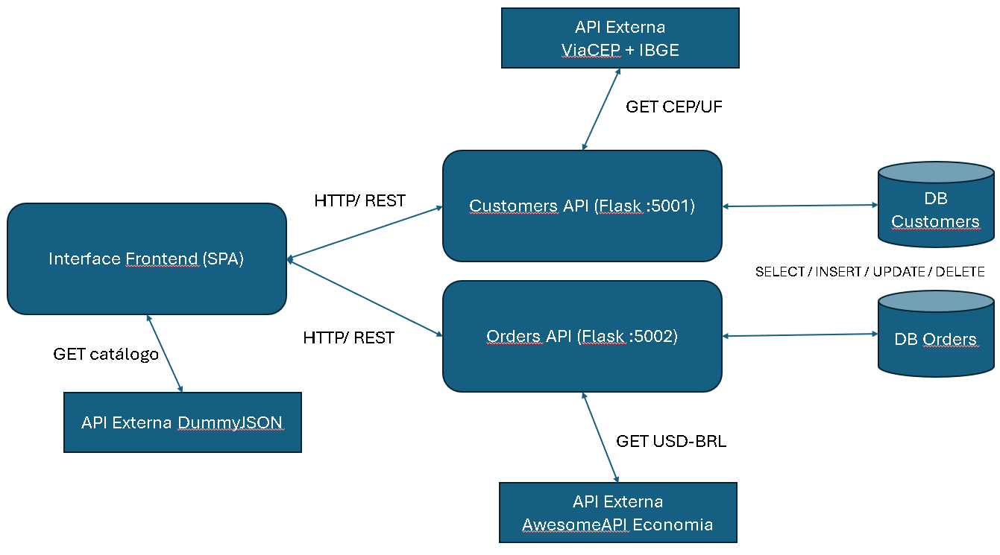

# MVP – Backend Avançado (PUC-Rio)

Este repositório reúne a entrega do **MVP da disciplina Backend Avançado** do curso de Pós-Graduação em Full Stack Development – PUC-Rio.

A solução é composta por **três componentes containerizados**:
- **Customers API** (Flask-RESTX): cadastro/autenticação de clientes e consulta de endereço via **ViaCEP + IBGE**.
- **Orders API** (Flask-RESTX): pedidos/itens e conversão **USD→BRL** usando **AwesomeAPI (Economia)
- **SPA** (React/Vite): frontend que consome as duas APIs internas e **DummyJSON** (catálogo) diretamente.

Todos os componentes possuem **Dockerfile na raiz** e **README próprio**. Há também um `docker-compose.yml` para subir tudo com um único comando.

---

## Arquitetura



---

## Demonstração em Vídeo
Link do vídeo de entrega:


##  APIs externas utilizadas (públicas e gratuitas)

**Usadas pela SPA (diretamente):**
- **DummyJSON** — catálogo de produtos  
  - URL: https://dummyjson.com  
  - Rotas: `/products`, `/products/search?q=`, `/products/{id}`  
  - Licença: pública e gratuita (sem API key)

**Orquestradas pelas APIs internas:**
- **ViaCEP** — CEP → logradouro/bairro/cidade/UF  
- **IBGE** — validação/complemento de UF/município  
- **AwesomeAPI (Economia)** — cotação **USD-BRL**

---


Variáveis esperadas pela SPA

Crie ./MVP-Backend-Avancado-SPA/.env com:

VITE_CUSTOMERS_API_URL=http://localhost:5000/api/v1
VITE_ORDERS_API_URL=http://localhost:5001/api/v1


##  Como executar

### Com Docker
```bash
docker build -t mvp-spa .
docker run --name mvp-spa --rm -p 8080:80 mvp-spa


## Desenvolvedor
Karsten Bento
Pós-graduação em Full Stack Development – PUC-Rio